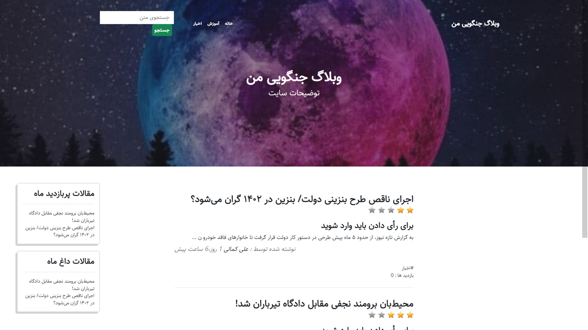
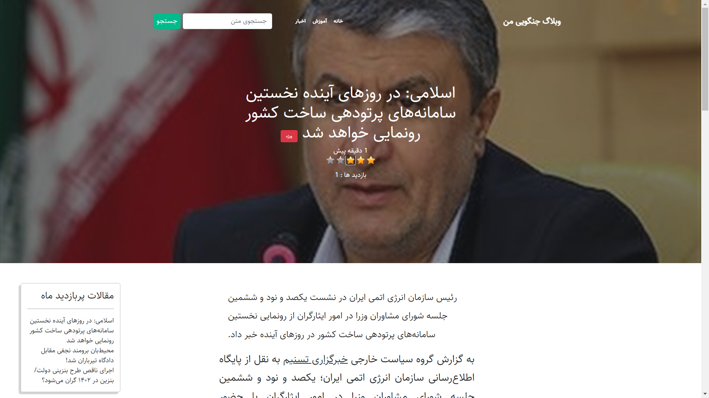
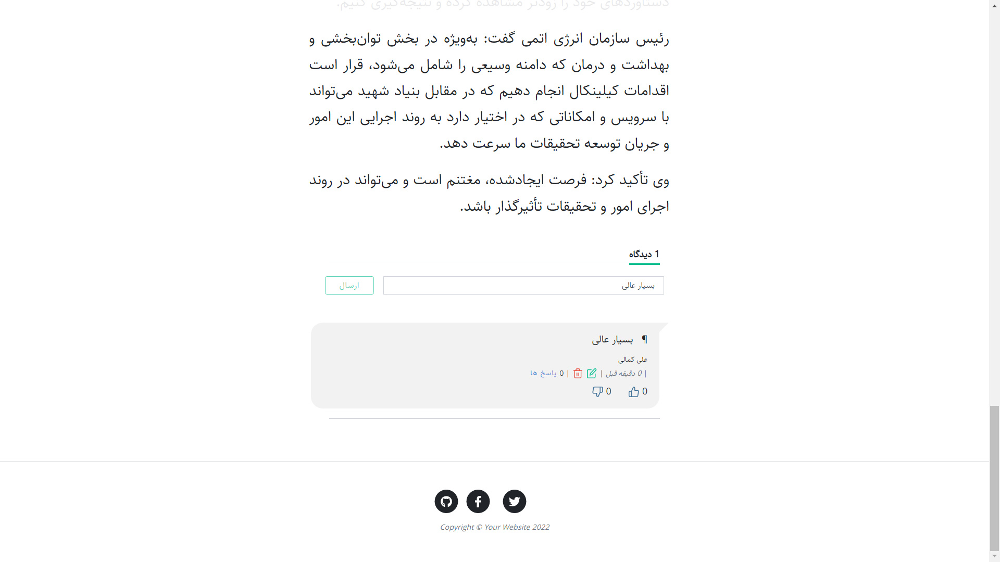
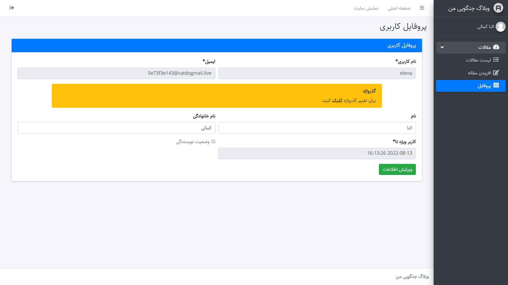
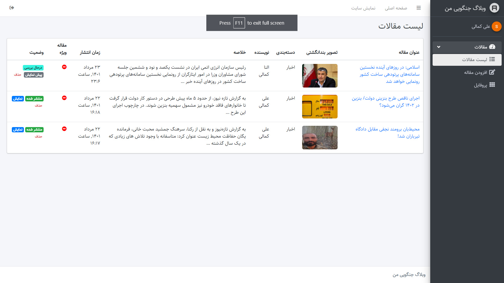
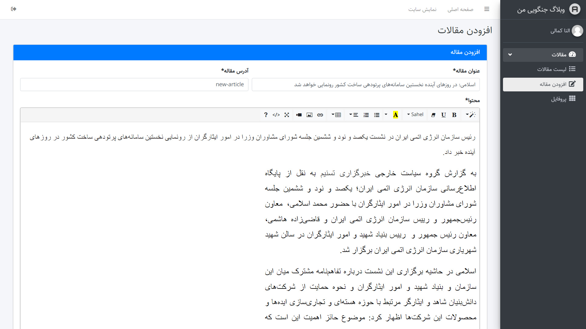

# ✨ My Django Blog

_A blog built by Django framework and has features such as comment system, star rating system, separate author and manager, hot articles, most visited articles (visit counting system), **API**, ...._

<br>

# 🚀 Starting

_These instructions allow you to get a copy of the running project on your local machine._

## 📋 Pre-requisites
_You need to have a 3.X version of Python_

## 🔧 Installation

- Make a git clone or download it in zip
    ```bash
    git clone https://github.com/irania9O/My-Django-Blog.git
    ```

- Get in the directory
    ```bash
    cd My-Django-Blog
    ```

- Install from your terminal with pip requirements.txt:
    ```bash
    pip install -r requirements.txt
    ```

- Create new migrations based on the changes you have made to your models:
    ```bash
    python manage.py makemigrations
    ```

- Apply migrations:
    ```bash
    python manage.py migrate
    ```

- To Create an admin user
    ```bash
    python manage.py createsuperuser
    ```

<br>

# 🧮 Start the development server

```bash
python manage.py runserver
```
_Now, open a Web browser and go to “/admin/” on your local domain – e.g., http://127.0.0.1:8000/admin/._
_You should see the admin’s login screen and home page on your local domain – e.g., http://127.0.0.1:8000/._

<br>


# 🌐 Api
- ## 👨‍✈️ Authorization
    _All API requests require the use of a generated Token or API Key. You can find your API key, on blew routers._

    ```http
    POST /api/rest-auth/login/
    POST /api/rest-auth/registration/
    POST /api/token/
    POST /api/token/refresh/
    ```

    | Header | Type | Required |Description |
    | :--- | :--- | :--- | :--- |
    | `Authorization` | `string` | **Yes** | `"Bearer "` + `"Your JWT access token"` |

<hr>
<br>

- ## ✋ Permissions
    _Users are limited based on their position on the site._

    | Position | Permissions |
    | :--- | :--- |
    | `SuperUser` | `/api/comments/` - `/api/rest-auth/` - `/api/token/` - `/api/articles/` - `/api/users/` |
    | `Author`    |  `/api/comments/` - `/api/rest-auth/` - `/api/token/` - `/api/articles/` |
    | `Member`    |  `/api/comments/` - `/api/rest-auth/` - `/api/token/` - `/api/articles/` -> **ReadOnly**|

<hr>
<br>

- ## 📇 Status Codes
    _Api returns the following status codes in its API:_

    | Status Code | Description |
    | :--- | :--- |
    | 200 | `OK` |
    | 201 | `CREATED` |
    | 400 | `BAD REQUEST` |
    | 401 | `UNAUTHORIZED` |
    | 404 | `NOT FOUND` |
    | 500 | `INTERNAL SERVER ERROR` |

<br>

# 🖼️ Screenshots
<br>








